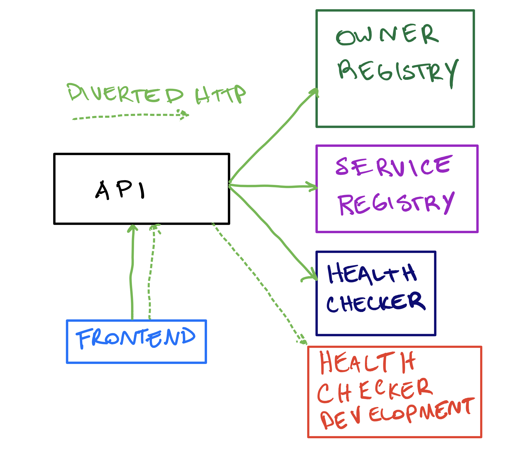

# Catalog

The catalog application is a demonstration application used for showing the Okteto divert feature set.
The application uses canned data to mimic a service catalog.
The service catalog tracks services, their owners and health information.

The original implementation contains only the most recent health data for each service in the catalog.
This is heplfult but it could be better.
A developer decides that health data for each service would be more helpful if it contained historical data.
In this scenario the developer adds a data store and changes the health-checking service to provide more data.
The developer uses the divert feature so that they can experiment and develop the new feature side-by-side with the original application.

# Original Application


# Divert Added for Development



# Demonstration

Deploy the application in Okteto Staging by pressing the following button:

[](https://staging.okteto.dev/deploy?repository=https://github.com/okteto/catalog)

Once the application is running, if you access the application endpoint (for example, catalog-chart-cindy.staging.okteto.net) the application will only display the service catalog with the last known health check response.

Now, change into the directory `health-checker` and run `okteto up`:

```
 ✓  Images successfully pulled
 ✓  Files synchronized
    Name:      cindy-health-checker
    URL:       cindy-health-checker-cindy.staging.okteto.net

Welcome to your development container. Happy coding!
cindy:cindy-health-checker app>
```

Run the application:

```
cindy:cindy-health-checker app> go run cmd/main.go
{"level":"info","time":"2021-05-25T23:08:46Z","message":"listening on :8080"}
```

Now you can access the original application at health-checker-cindy.staging.okteto.net and the dev version of your application at  cindy-health-checker-cindy.staging.okteto.net.
The divert feature is diverting specific traffic from the original health-checker service to the one under development.
Historical health data will now be present for the service catalog page.

Happy coding!
