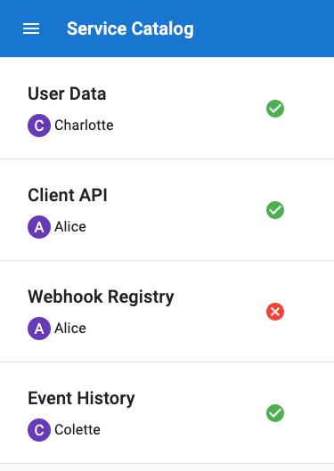

# Catalog

The catalog application is a demonstration application used for showcasing the Okteto divert feature set.
The application uses canned data to mimic a service catalog.
The service catalog tracks services, their owners, and health information.

The original deployment contains only the most recent health data for each service in the catalog.
This is heplful but it could be better.

A developer decides that health data for each service would be more helpful if it contained historical data.
In this scenario the developer adds a data store and changes the health-checking service to provide more data.
The developer uses the divert feature so that they can experiment and develop the new feature side-by-side with the original application.

Let's get started!

## Prerequisites

- Install the Okteto CLI. Follow this [guide](https://okteto.com/docs/getting-started/installation) if you haven't done it yet.
- Configure Access to your Okteto Cloud Namespace [using the Okteto CLI](https://okteto.com/docs/cloud/credentials#download-your-kubernetes-credentials-using-the-okteto-cli) or [using the Okteto Cloud UI](https://okteto.com/docs/cloud/credentials#download-your-kubernetes-credentials-from-the-okteto-cloud-ui).
- Clone this repo locally. `git clone https://github.com/okteto/catalog.git`

## Deploy Application

Deploying the service catalog sample application is as simple as...

```console
$ okteto pipeline deploy --wait
 ✓  Pipeline 'catalog' successfully deployed
```

The `okteto pipeline deploy` command creates all of the necessary components for your app to run with Okteto in Kubernetes.

After your pipeline has successfully deployed your application visit [Okteto Cloud](https://cloud.cokteto.com/#/?origin=docs).
Once you have this pulled up you can see your pipeline deployed and the URL that was created for the application.
The URL will be similar to `https://catalog-chart-cindy.okteto.net`.

Visiting the URL will bring up the service catalog application with only the most recent health data available.



## Create Development Resources

Now, change into the directory `health-checker` and run `okteto up`:

```console
$ cd health-checker
$ okteto up
 ✓  Images successfully pulled
 ✓  Files synchronized
    Name:      cindy-health-checker
    URL:       cindy-health-checker-cindy.staging.okteto.net

Welcome to your development container. Happy coding!
cindy:cindy-health-checker app>
```

At this point we have duplicated the health-checker service and have the original deployment and a development deployment.
Along with the development deployment there is now a new URL similar to `https://cindy-catalog-chart-cindy.okteto.net`.
Accessing the application with the development URL will divert all traffic bound to the health-checker service to your development deployment.

## Edit Application

The application code already contains an advanced health checker client that has historical health data.
Now, we need to make use of this newly developed advanced health checker.
To do so we edit the file `health-checker/cmd/main.go` so that the health handler uses your advanced client.


## Run Modified Application

With our edits in place it is now time to run the application in the development container.
Build and run by typing `go run cmd/main.go` in the container.

```console
Welcome to your development container. Happy coding!
cindy:cindy-health-checker app> go run cmd/main.go
go: downloading github.com/caarlos0/env v3.5.0+incompatible
go: downloading github.com/justinas/alice v1.2.0
go: downloading github.com/rs/zerolog v1.22.0
go: downloading github.com/rs/xid v1.2.1
{"level":"info","time":"2021-05-28T18:55:13Z","message":"listening on :8080"}
```

Now if you visit the development url you can see the changes live.
The original application is left untouched and is still available at the original url.


